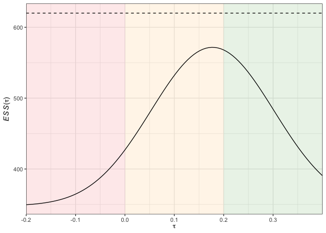

<!-- README.md is generated from README.Rmd. Please edit that file -->


# OptGS

*Optimal and near-optimal group-sequential designs for clinical trials with continuous outcomes*

[](https://cran.r-project.org/package=OptGS)
[](https://cran.r-project.org/package=OptGS)
[](https://cran.r-project.org/package=OptGS)
[](https://doi.org/10.18637/jss.v066.i02)
[](https://github.com/mjg211/OptGS)
[](https://github.com/mjg211/OptGS)


## Introduction

__OptGS__ is an [R](https://www.r-project.org/) package that provides a suite of functions to assist with the design, analysis, and visualization of randomized two-arm group-sequential clinical trials with continuous outcome variables.

Specifically, support is provided to perform a sample size calculation for each
of the most popular relevant (non-optimal) designs. The unique focus, however,
is on determining optimal and near-optimal designs, using the methods from
[Wason *et al* (2012)](https://doi.org/10.1002/sim.4421) and [Wason (2015)](https://doi.org/10.18637/jss.v066.i02) respectively.

Additional functions then allow point estimates, p-values, and confidence
intervals to be determined for possible results in these designs. Plotting
functions also permit the informative depiction of several important quantities.

## Installation

You can install the released version of __OptGS__ from
[CRAN](https://cran.r-project.org/web/packages/OptGS/index.html) with:


```r
install.packages("OptGS")
```

Alternatively, the current development version from
[Github](https://github.com/mjg211/OptGS) can be installed with:


```r
devtools::install_github("mjg211/OptGS")
```

## Example: Near-optimal design

This is a basic example, which demonstrates how to determine an optimized
power-family design (a near-optimal design), plot its stopping boundaries,
determine its operating characteristics, and subsequently produce a plot of the
expected sample size curve.

First, determine the design (for the default parameters) with:


```r
des <- des_nearopt()
```

We can then plot the stopping boundaries of this design with:


```r
plot(des)
```


The operating characteristics of the design can also be determined with:


```r
opchar <- opchar(des, tau = seq(-des$delta, 2*des$delta,
                                length.out = 100))
```

Finally, we can then plot the expected sample size and power curves for this design using:


```r
plot(opchar)
```



## Changes: v.1.1.1 vs. v.2.0.0

Between v.1.1.1 (the latest released version on
[CRAN](https://cran.r-project.org/web/packages/OptGS/index.html)) and v.2.0.0 (the current development version on [Github](https://github.com/mjg211/OptGS)), several major changes were made to __OptGS__:

- Dependence on C++ code was replaced with equivalent [R](https://www.r-project.org/) functionality for stability and ease of further development.
- Support for additional plots were added (e.g., median sample size curves).
- Functions to determine operating characteristics (`opchar()`), perform
inference on trial conclusion (`an()`), simulate group-sequential trials (`sim()`), and build bespoke designs (`build()`) were added.
- Arguments in, and names of, previously present functions have been modified
(e.g., `optgs()` is replaced by `des_nearopt()`).

Consequently, if all that you require is the functionality presented in [Wason (2015)](https://doi.org/10.18637/jss.v066.i02), it will likely be quicker to use v.1.1.1 from [CRAN](https://CRAN.R-project.org), which is a substantially simpler and also faster (in terms of execution time) package.

However, as time progresses, the additional support provided by
v.2.0.0 and onwards should make them preferable with some small time investment
to understand the purpose of the different functions.

## Support

An extensive guide to using __OptGS__ will soon be provided in the form of a package
vignette. For v.1.1.1 and earlier, [Wason (2015)](https://doi.org/10.18637/jss.v066.i02) also provides a detailed introduction to the package.

If you cannot find the answer to a problem, or a function is returning an unexpected error for your inputs, please contact James Wason (james.wason@newcastle.ac.uk) or Michael Grayling
(michael.grayling@newcastle.ac.uk) for assistance.

## References

Wason JMS (2015) OptGS: An R package for finding near-optimal group-sequential
designs. *Journal of Statistical Software* 66(2):1--13. DOI: [10.18637/jss.v066.i02](https://doi.org/10.18637/jss.v066.i02).

Wason JMS, Mander AP, Thompson SG (2012) Optimal multistage designs for randomised clinical trials with continuous outcomes. *Statistics in Medicine* 31(4):301--312. DOI: [10.1002/sim.4421](https://doi.org/10.1002/sim.4421).
